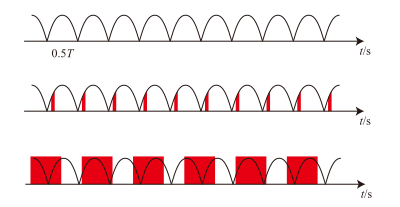

# 相机（Camera）

## 认识相机

-   相机的核心是传感器，此处围绕传感器展开。
-   当今的传感器一般为 CMOS，上面一般还有两层重要的结构，低通滤镜（较外层）和拜尔滤镜（紧贴传感器）。
-   传感器可以认为是若干个光敏半导体颗粒排列而成的，通过统计上面产生的电荷量，就可以推测打在其上的光子个数。
-   但传感器不能分辨光的颜色。由于相机是为人服务的，人眼的三原色是红、绿、蓝，因此人们制作了对应颜色的滤镜，使得每个像素点仅记录一种颜色的亮度。又由于人眼对绿色更为敏感，因此绿色像素数较多。常见的滤镜排列是拜耳滤镜，一个单元为四个像素，两个对角线上分别为（RB)、(GG)。
-   因此实际上每个像素对应的另外两种颜色是由临近的该种颜色计算出来的。
-   也就是说 1200 万像素的传感器，只有 300 万个完整的 RGGB 像素阵列（但这种说法并不严谨，请参考对焦部分）。
-   CMOS 的每个像素由开关控制开始曝光和读出数值（但不能控制结束曝光）。例如你可以控制像素对应的电子数一直为 0，此时不会被光改变。当不控制电子时即为开始曝光，而读出时只能立即读出当前值。
-   传统的 CMOS 需要逐个像素读出（实际上一行内是很快的，但行与行之间的时间差是肉眼可见的）。
-   部分先进的 CMOS 可以同时读出整块 CMOS 上的数值。
-   传统 CMOS 会出现果冻效应。考虑一个物体在从左向右运动，CMOS 由于读出每行需要一定的时间，又要保证每个像素的曝光时间一致，因此下面的行整体而言曝光就要比上面的行延后。因此实际拍摄时，在下一行曝光时，物体总是比上一行曝光时向右移动了一些，这就导致了出现明明是竖直的物体变斜的情况。
-   在部分机器，整块 CMOS 可以通过位移来达到（部分，并非完全）抵消机身抖动的效果。请在「[影像稳定](stabilization.md)」部分中查看。

## 快门速度

-   传感器每个像素接收光线的时间越长，就可以捕获更多光子。这个时间不宜过长也不宜过短，一般为曝光每秒帧速率 2 倍的倒数。例如每秒 30 帧的视频，曝光时间为 1/60 秒左右为宜。简单而言，曝光过长会导致画面“拖影”严重，而过短画面会出现不连贯感。以下为两个注意事项：

### 「人眼的帧率」

-   我们常说人眼是每秒 24 帧，每秒 24 帧是可以在人眼实现连贯的画面的最小值，超过每秒 24 帧的画面一定会比每秒 24 帧更流畅，据我身边人反映，一般在观看视频时，每秒 100 帧以上的帧速率才会出现比较明显的边界效应。人眼视觉暂留更像是一个滑动窗口范畴下的卷积过程。按经验，实际上是：
-   设任意时刻光强为 $f\left ( t \right )$，当前时刻为 ${t}_{0}$，则当前人眼反映亮度应该是

$$
\int^{t_0}_{t_0-1\text{s}/24} {f\left (t\right)g\left ( {t_0-t} \right )dt}
$$

其中 $g (x)$ 在 $[ 0, 1\text{s}/24 ]$ 上单调递减，且 $g ({x})\to 0 ( {x\to \frac {1\text{s}} {24}} )$。

### 工频防闪烁

工频防闪烁有两种做法：

- 使帧间隔为半周期的整数倍
    - 弊端：仅限灯光频率（这通常是市电频率的 2 倍）整除帧率时可使用；第一帧的开始时间不同，画面亮度会有差异。
    - 优点：快门速度是可以变化的。
- 使快门时间为半周期的整数倍
    - 弊端：快门时间最少也只能为市电半周期（即灯光闪烁周期），且必须是这个周期的整数倍。
    - 优点：适用于不同帧率，以及非整数频率的 LED 灯光。

两种方式在 50Hz 正弦波光源（所以图上波形的频率是 100Hz）下的原理如图解释。第一种按 100fps；第二种按 60fps，每次曝光 1/100s。

可见每个色块的线下面积是相同的，因此每帧的亮度是相同的。

## 快门角度

同快门速度，这是由于早期的摄像机使用旋转的叶片来遮光，另外与切换下一张胶片的频率同步，因此叶片打开的程度就决定曝光时间。设快门角度为 $degree$，帧率为 $fps$ （单位：$s^{-1}$），则每帧曝光时间为
$\frac{degree}{360}\times \frac{1}{fps}$ 。

## 感光度

感光度决定了光强与输入到处理器的画面亮度的关系。这通常由模拟放大电路和数字放大电路组成。一般情况下，每套模拟放大电路只能处理一个放大倍数，若需要多个放大倍数就需要若干组放大电路。目前常见的摄像机为 1 或 2 组放大电路。
当前使用 [ISO 12232:2019](https://www.iso.org/standard/73758.html) 标准定义感光度。
感光度是线性的。在传感器前滤除 50% 的光，并将感光度设为 200，应当与不滤除光，感光度设为 100 的情况类似。
由于相机的模拟电路实际的放大倍率是固定的，采用模拟电路放大出的信号不做增益或衰减的值，称为基准 ISO。只有在两组放大电路得到的动态范围相同的情况下可称为双原生 ISO，若动态范围不同只能称为双基准 ISO 或双增益。
在相机内部调整 ISO，本质上是由相机自动选择一个临近的基准 ISO 后通过数字电路（以及处理器）进行处理，这会减小动态范围。

更多关于感光度的内容会在「[了解 ISO](iso.md)」部分阐述。

### 噪声、信噪比

噪声指非期望情况下的，可通过大量随机重复消除（但实际上曝光时间有限，不可以大量重复）的杂乱信号。
噪声可能在不同阶段引入。

-   散粒噪声。物理意义上的，在极暗情况下的，均匀光照也可能出现不同像素的光子数就是不同的，这是由于光是概率波，服从泊松分布。
-   在模拟放大电路及之前引入的噪声。
-   在数字放大电路及之前引入的噪声。

请注意，每次放大都会同步放大噪声。这也就是使用两套模拟电路进行放大而非只用数字电路放大的原因，这是为了规避模拟放大电路本身和模数转换过程产生的噪声被放大。

信噪比的定义请查看 [ISO 15739:2023](https://www.iso.org/standard/82233.html) 标准，此处给出定性解释：信噪比越大，画面越纯净，在某种意义上的画质更好。

更多关于噪声、信噪比的内容会在「[了解 ISO](iso.md)」部分阐述。

### 动态范围、宽容度

当前使用 [ISO 15739:2023](https://www.iso.org/standard/82233.html) 标准。

-   档位：可分辨出的最亮与最暗功率之商差距以 2 为底的对数。
-   SNR=1 情况下测得的档位称为动态范围。
-   SNR=10 情况下测得的档位称为宽容度。

请注意，传感器，额外降噪，视频编码等都可能导致动态范围下降或上升。

部分关于动态范围、宽容度的内容会在「[了解 ISO](iso.md)」部分阐述。
