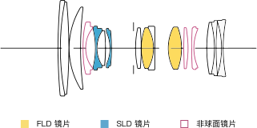
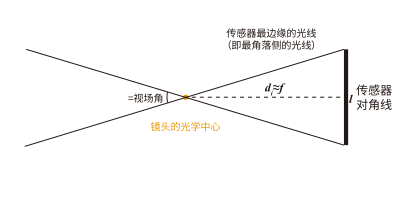
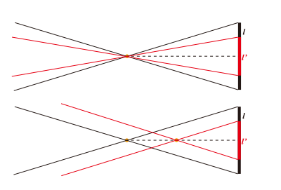
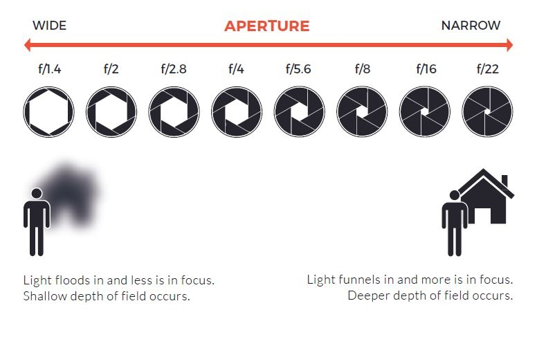
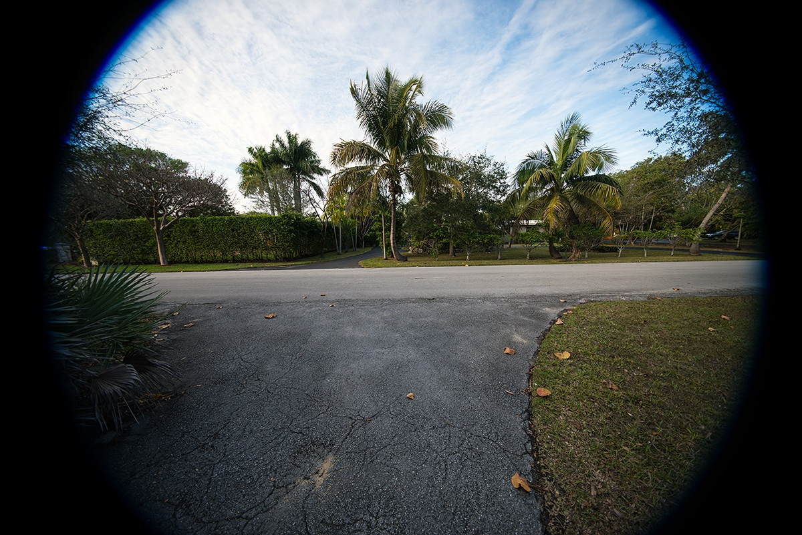

# 镜头（Lens）

此处不考虑反射镜头。

## 认识镜头

-   镜头可以等效为一块 [凸透镜](https://www.kepuchina.cn/article/articleinfo?business_type=100&ar_id=246164)。
-   为什么往往不使用一块凸透镜来作为镜头，而是使用大大小小的多块镜片组合成镜头呢？
    -   由于不同颜色（波长）的光在同一介质的折射率不同、对曝光的控制需要、对影像「放大」「缩小」、对防抖的需求等，我们使用镜片的组合来达到理想的成像效果。
-   当与光轴平行的光线射入凸透镜时，理想镜头将所有的平行光线聚集在一点，再以锥状的扩散开来。这个聚集所有光线的点，叫做**焦点**，焦点和镜片光学中心的距离叫做**焦距**。
-   物体的某一点发出到镜片任意位置的所有平行光线经过折射后汇聚到的点是一个焦点，这些由物体上所有的点发出的不同方向的平行光汇聚形成的点组成的平面为焦平面。
-   镜头的工作就是将物体发出的光线经过折射，汇聚到传感器 / 胶片上形成清晰的影像。感光元件所处的位置即为焦平面，在机身上通常用 Φ 符号表示。

## 光学结构

-   举例说明，一般镜头都会给出其镜片示意图，其中水平轴为光轴，左侧为入射（物体所在）方向，右侧为相机。竖线位置为光圈位置。
-   实际使用中，你无需过分关心镜头的内部结构。

### 镜头的光学参数与对应实际应用当中的区别

**定焦与变焦/焦距与视角**

为什么焦距能够决定视角？即为什么焦距小的镜头，可以获得更广的视野？

回顾初中物理当中凸透镜成像的知识，我们有以下公式：

$$
\frac{1}{f} = \frac{1}{d_o} + \frac{1}{d_i}
$$

其中 $f$ 为焦距，$d_o$ 为物距，$d_i$ 为像距。

因为对于相机而言，镜头的光学中心与传感器之间的距离（即 $d_i$）也就是几厘米，长焦镜头有几十厘米，而镜头的光学中心与被拍摄物体（即 $d_o$）的距离一般远大于这个距离（一般至少几米），因此 $\frac{1}{d_o}$ 可以忽略不计，因此我们可以近似地认为：$d_i \approx f$。这样一来，我们就有了以下的示意图：

也就是说，这个视角 $\theta$ 基本上由焦距 $f$ 和传感器的宽度 $l$ 决定： 

$$ l = 2f \tan(\frac{\theta}{2}) $$

- 定焦镜头则是指焦距固定的镜头，变焦镜头则是指焦距可调节的镜头。
- 由于焦距可以调节，则可以让视角也可以调节，因此变焦镜头更为灵活。

> 一个衍生问题：不同传感器大小与等效焦距

如图上半部分，同一个镜头，如果传感器变小，则相当于只取画面中间部分，则视角变小了。

下半部分则表示，如果要达到相同的视角，则光学上要选择更小的焦距，并且在通常情况下，这个焦距的系数与传感器对角线的长度成正比。

**大光圈与小光圈**

像有多亮？在发出光线的物体发光强度确定的情况下，这就跟镜头捕获了多少光线有关。实际上，为了简化，我们用「光圈」来表示镜头捕获光线的能力。实际上光圈（aperture）是一个机械结构，它决定了有多少光线能够通过镜头进入相机。

我们假设有一个通光口径，并且进入的光线强度应该与这个口径的面积成正比。但是需要注意，由于焦距比较长的镜头，本身就是在捕获更少的光线，因此我们用「相对于焦距的口径」来表示光圈大小，也就是 F 值，即**光圈值（F-stop）**，通常使用 $f/N$ 来表示，$N$ 为光圈值。[^1]

$$
F = \frac{f}{D}
$$

其中 $f$ 为焦距，$D$ 为通光口径。

!!! Note
    由于镜头结构、光学元件性质、镀膜类型等因素，实际镜头的透光率无法达到 100% ，而相对孔径 F 值只是从几何光学的定义而来，没有考虑到上述因素，所以不能够准确地表达镜头通光能力。因此，有些专业镜头会标注 **T 值**，即**传输光圈值（Transmission stop，T-stop）**或曝光级数，表示实际进入相机的光线强度。

    一定功率的入射光被界面折射的功率比例称为透射率（Transmittance）[^2]，它是电磁波穿越一种表面或一种光学元件的一种测量值。两支具有相同 F 值的镜头可能会有不同的透射率，透射率用 $T$ 来表示，这里 $T \leq 1$。对于一个圆形光圈透射率为 $T$ 的镜头，实际有效光圈是：

    $$
    \text{T 值} = \frac{\text{F 值}}{\sqrt{T}}
    $$

    在电影等严肃的艺术创作中，更推荐使用 T 值，这可以帮助摄影师在更换镜头或场景时，依然保持相同的曝光效果，确保整体场景的光度不受影响。

光圈是一个机械结构，并且一般而言使用叶片控制光圈的大小。光圈越大，叶片张开越大，光线进入越多，F 值越小（例如 F/1.4）。光圈越小，叶片张开越小，光线进入越少，F 值越大（例如 F/16）。

自动镜头的光圈（即电子控制光圈）是通过电子信号控制叶片的张开程度来调节光圈大小的。这种镜头可以在相机上直接调节光圈大小。部分老式镜头（例如徕卡 M 镜头）是通过机械结构来调节光圈大小的，这种镜头需要在镜头上直接调节光圈大小。

另外更古老的镜头的光圈并非叶片控制，而是通过更换不同大小的光圈片来调节光圈大小。

-   光圈是控制曝光的利器，然而并不是所有情况都应当调整光圈来调整曝光。
-   光圈会影响景深（俗称背景/前景虚化），光圈越大景深越浅（虚化效果越明显）。具体会在「[了解对焦](focus.md)」部分阐述。
-   由于光学设计原因，镜头的成像会产生球差、慧差、暗角的情况，缩小光圈可以改善慧差和暗角，但不可以改善球差。光圈过小（一般认为 F/16 及以后）会产生衍射，画质下降。现代镜头基本可以保证在最大光圈下仍然在 4K 视频的输出的情况下有较为出色的表现，无须担心全开光圈。

> 最大光圈与最小光圈：镜头会标注其最大光圈和最小光圈，例如 F/1.4-F/16。最大光圈越大（F 值越小），镜头一般越贵且越大且重。最小光圈并不重要，一般而言 F/16 及以后已经没有什么意义。
> 变焦镜头分为浮动光圈和恒定光圈，这分别表示在不同焦距下的最大光圈是不一致和一致的。

**像场**

-   镜头的像场是指镜头能够成像的范围，一般而言，像场越大，镜头越贵且越大且重。

镜头一般设计为覆盖对应大小的胶片/传感器，例如全画幅（35mm）、APS-C、M4/3 等。镜头的像场如果小于传感器大小，则会产生暗角。

## 镜头卡口与法兰

-   不同的光学系统存在着不同的局限性，为了应付各种场合，常需要使用各种不同的镜头。对于可更换镜头的相机而言，我们需要一种易于快速将镜头与相机机身拆卸安装的接口。连接相机机身与镜头的金属盘状结构可以被称之为法兰（Flange）。
-   安装法兰到焦平面之间的距离叫做法兰距（Flange Focal Distance）。
    -   请注意，不要将法兰距与「镜后距」(Back Focal Length) 混淆。镜后距是指镜头的最后一组镜片与焦平面之间的距离。
-   能让相机更换不同的镜头。 对于专业级的拍摄或摄像设备而言（照相机和电影摄像机），为了应付各种场合，常需要使用各种不同的镜头。而不同厂商所生产的器材间接环往往互不兼容，故需选择相同接口的镜头和相机搭配使用，或使用镜头转接环进行转换。

## 镜头上的其他设计

-   镜头的镜片上会有镀膜，来减少反射和眩光。
-   镜头前端可能会有遮光罩，来减少眩光和保护镜头，一般而言可以拆卸和反向安装，以便于携带，**使用时强烈建议安装遮光罩**。
-   镜头最前端会有滤镜螺纹，购买对应尺寸的滤镜可以拧上。请在「[*滤镜](A_filter.md)」部分查看。
-   镜头上一般至多有三个环，分别是对焦环、变焦环和光圈环（部分镜头没有光圈环）。对焦环用来调节对焦（请在「[了解对焦](focus.md)」查看），变焦环用来调节焦距（仅限变焦镜头），光圈环用来调节光圈大小。
-   镜头上可能会有一些开关，例如防抖动开关、对焦模式开关（自动对焦/手动对焦）、对焦范围限制开关等，以及自定义按钮，这些开关和按钮的功能请参考镜头说明书。
-   卡口的电子触点用来提供电源和通信。
-   部分镜组可通过位移来抵消抖动，请在防抖动一部分中查看。
-   除此之外还有一些高级玩法，例如增倍（增焦减光）、减焦增光、卡口转接等操作，本部分不再提及。

[^1]: Photography — Apertures and related properties pertaining to photographic lenses — Designations and measurements: ISO 517:2008[S/OL]. 2008.
[^2]: Hecht E. Optics[M]. Fifth Edition. Pearson Education Incorporated, 2017.
